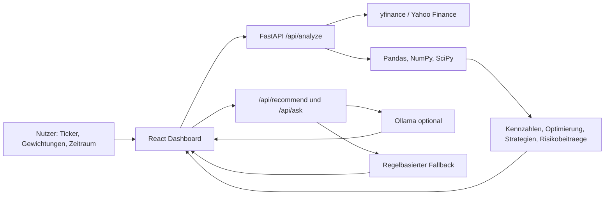

# Architektur

## Systemueberblick

Das Projekt besteht aus drei Schichten:

1. Praesentationsschicht: React/Vite Dashboard in `src/`
2. Quant- und Daten-Schicht: FastAPI Backend in `backend/`
3. KI-Interpretationsschicht: Ollama HTTP API mit regelbasiertem Fallback

## Frontend

Das Frontend nutzt React, TypeScript, Vite, Recharts und lucide-react. Die Hauptdatei ist `src/App.tsx`; API-Aufrufe sind in `src/lib/api.ts` gekapselt. Gespeicherte Portfolios werden ueber `src/lib/portfolioStorage.ts` im Browser-LocalStorage abgelegt.

## Backend

Das Backend nutzt FastAPI. Relevante Routen:

- `GET /api/health`
- `POST /api/analyze`
- `POST /api/recommend`
- `POST /api/ask`
- `POST /api/export/csv`
- `POST /api/export/pdf`

## Datenabruf

Historische Kursdaten werden ueber `yfinance` geladen. Das Backend nutzt einen einfachen In-Memory-Cache mit sechs Stunden Gueltigkeit fuer gleiche Ticker, Zeitraum und Frequenz.

## Berechnungslogik

Die Quant-Logik liegt in `backend/analysis.py`:

- Renditen aus Schlusskursen
- annualisierte Rendite und Volatilitaet
- Korrelations- und Kovarianzmatrix
- Sharpe Ratio
- historischer Value at Risk
- Max-Sharpe-Optimierung
- alternative Strategien
- Risikobeitrag je Position ueber Kovarianzmatrix

## KI-Komponente

Die KI bekommt nur strukturierte Analyseergebnisse. Sie darf keine Kurse, Kennzahlen oder Marktdaten erfinden. Wenn Ollama nicht erreichbar ist, erzeugt das Backend regelbasierte Empfehlungen, einen strukturierten Bericht und Antworten auf Rueckfragen.

## Speicherung

Portfolios werden im Browser per LocalStorage gespeichert. Enthalten sind Name, Assets, Gewichtungen, Erstell-/Aenderungsdatum und optional das letzte Analyseergebnis. Die Speicherung ist bewusst gekapselt, damit spaeter eine Datenbank ersetzt werden kann.

## Caching

Kursdaten werden serverseitig in einem In-Memory-Cache gehalten. Der Cache ist pro Backend-Prozess gueltig und wird bei Neustart geleert. Das ist fuer den MVP ausreichend, ersetzt aber kein persistentes Produktions-Caching.
