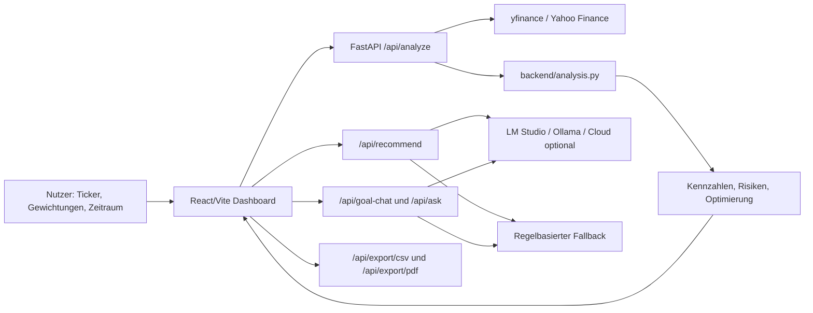

# Architektur

## Systemüberblick

```mermaid
flowchart LR
  U["Nutzer: Ticker, Gewichtungen, Zeitraum"] --> F["React/Vite Dashboard"]
  F --> A["FastAPI /api/analyze"]
  A --> Y["yfinance / Yahoo Finance"]
  A --> Q["backend/analysis.py"]
  Q --> R["Kennzahlen, Risiken, Optimierung"]
  R --> F
  F --> I["/api/recommend"]
  F --> G["/api/goal-chat und /api/ask"]
  I --> L["LM Studio / Ollama / Cloud optional"]
  G --> L
  I --> B["Regelbasierter Fallback"]
  G --> B
  F --> X["/api/export/csv und /api/export/pdf"]
```

## Frontend

Das Frontend liegt in `src/` und nutzt React, TypeScript, Vite, Recharts und lucide-react. `src/App.tsx` verwaltet Portfolio- und Workspace-Zustand. Wiederverwendbare Darstellungskomponenten liegen in `src/components/`; API-Verträge und HTTP-Aufrufe liegen in `src/lib/api.ts`, `src/lib/chatClient.ts` und `src/lib/exportClient.ts`. Portfolios werden über `src/lib/portfolioStorage.ts` im Browser-LocalStorage gespeichert.

Vor der ersten Analyse zeigt die Oberfläche keine berechneten Kennzahlen. Nach einer Analyse werden Live-Ergebnisse oder ein vom Backend gekennzeichneter Demo-Fallback dargestellt. Änderungen an Ticker, Gewicht oder Zeitraum markieren ein bestehendes Ergebnis als veraltet und löschen nur das nicht mehr gültige Ergebnis; Wizard-Auswahl und Chat bleiben erhalten.

## Backend-Module

- `backend/main.py`: FastAPI-App, CORS, Validierung über Response-Modelle, Chat-Rate-Limit und Routen.
- `backend/models.py`: Request-/Response-Verträge für Analyse, Empfehlungen, Chat und Export.
- `backend/analysis.py`: Kursabruf, Renditen, Risiko, Diversifikation, Risikobefunde und Optimierung.
- `backend/recommendations.py`: profilbezogene Gewichtungsvorschläge, Provider-Kette, strukturelle Validierung und Regelmodus.
- `backend/conversation.py`: Zielgespräch, Digest-Aufbau, Rückfragen, Regelantworten und LLM-Guardrails.
- `backend/market_intelligence.py`: Asset-Metadaten, optionale Alpha-Vantage-News und lokale Fallback-Kataloge.
- `backend/exports.py`: CSV-Export sowie PDF mit Chart, Vergleich, KI-Auswertung und Methodik.

## Routen

- `GET /api/health`
- `GET /api/securities/search`
- `GET /api/system/llm-check`
- `POST /api/analyze`
- `POST /api/recommend`
- `POST /api/goal-chat`
- `POST /api/ask`
- `POST /api/export/csv`
- `POST /api/export/pdf`

Die Chat-Routen akzeptieren höchstens 20 Nachrichten im Request und sind pro Client-IP auf 20 Anfragen pro Minute begrenzt. Exportdaten werden über den typisierten `ExportRequest` validiert.

## Daten- und KI-Grenze

Die Quant-Schicht berechnet alle Zahlen. Die Interpretationsebene erhält für Empfehlungen und Rückfragen einen kompakten Analyse-Digest mit vorhandenen Assets, Kennzahlen, Risiken, Sektoren und optimierten Gewichten. Roh-Kovarianz und unnötige Performance-Rohdaten werden nicht in den Chat-Digest übernommen. LLM-Ausgaben werden auf JSON-Form, Länge, bekannte Ticker und unzulässige Kauf-/Verkaufssprache geprüft; bei Fehlern fällt die Anwendung auf Regeln zurück.

Die Provider-Reihenfolge für `llmPreference=auto` ist LM Studio, Ollama, optionale Cloud-API und Regelmodus. `local` überspringt die Cloud, `cloud` nutzt nur den konfigurierten Cloud-Provider und danach Regeln. Ohne Provider verlassen Portfoliodaten den Rechner nicht.

## Persistenz und Caching

Portfolios werden ausschließlich im Browser gespeichert. Der aktuelle Backend-Kursabruf verwendet keine persistente Datenbank und keinen dokumentierten serverseitigen Langzeit-Cache. Bei Neustart können Daten erneut von Yahoo Finance geladen werden.
