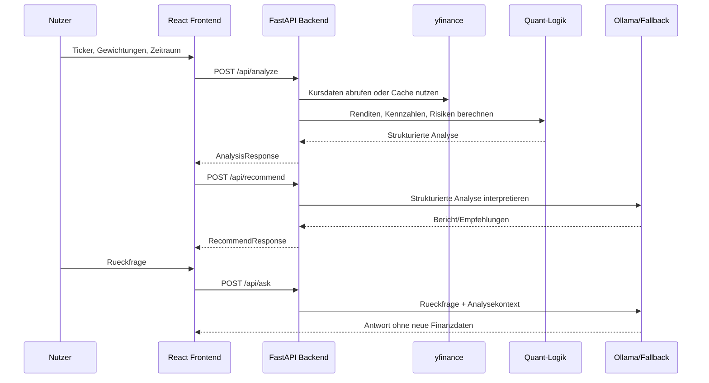

# Datenfluss

## Ablauf

## Strukturierte Uebergabe an die KI

Die KI erhaelt:

- Portfolio-Kennzahlen
- Asset-Liste mit Gewichtung, Rendite, Volatilitaet, Assetklasse, Sektor, Region und Risikobeitrag
- Asset Allocation
- Risikohinweise
- alternative Strategien
- optimierte Gewichtungen

## Trennung von Berechnung und Interpretation

Die Berechnung liegt vollstaendig im Backend. Die KI interpretiert nur vorhandene Daten. Dadurch bleibt die Methode nachvollziehbar: Kennzahlen entstehen regelbasiert, die KI formuliert daraus verstaendliche Texte.

## Fehlerfaelle

- Fehlende oder ungueltige Kursdaten fuehren zu nutzerfreundlichen API-Fehlern.
- Ollama-Ausfall fuehrt zum regelbasierten Fallback.
- Unbekannte Ticker-Metadaten werden als `Unknown` und `metadataStatus=unknown` markiert.
- Ungueltige Gewichtungen werden von Pydantic validiert.
