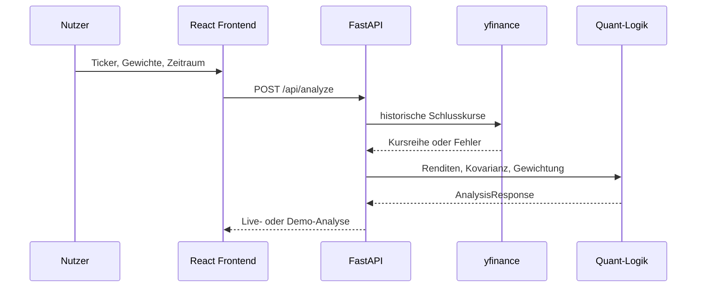
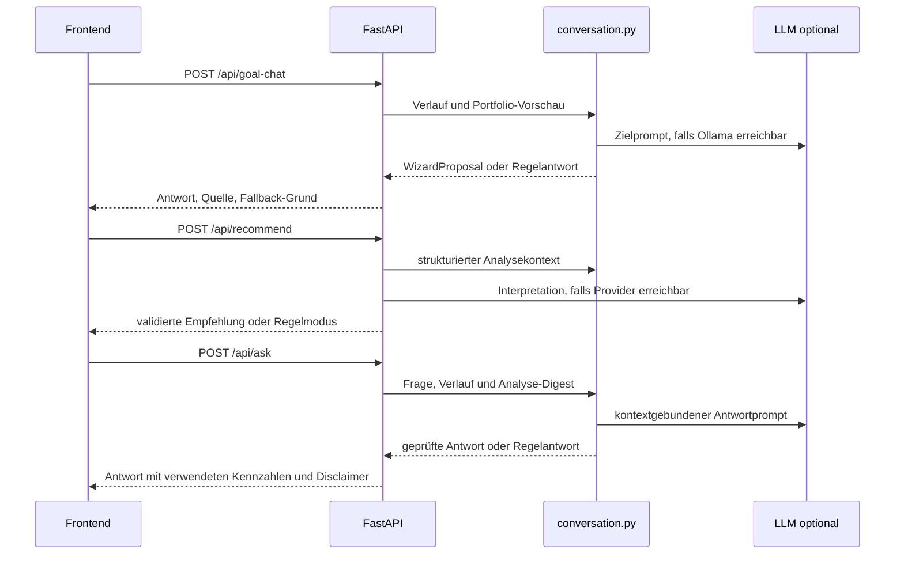

# Datenfluss

## Analyse

```mermaid
sequenceDiagram
  participant U as Nutzer
  participant F as React Frontend
  participant B as FastAPI
  participant Y as yfinance
  participant Q as Quant-Logik

  U->>F: Ticker, Gewichte, Zeitraum
  F->>B: POST /api/analyze
  B->>Y: historische Schlusskurse
  Y-->>B: Kursreihe oder Fehler
  B->>Q: Renditen, Kovarianz, Gewichtung
  Q-->>B: AnalysisResponse
  B-->>F: Live- oder Demo-Analyse
```

Schlägt der Live-Datenabruf mit einem erwartbaren Marktdatenfehler fehl, erzeugt das Backend deterministische Demo-Kursdaten und setzt `mode=demo` sowie einen ausdrücklichen Demo-Hinweis. Nicht erwartbare Validierungsfehler werden als API-Fehler zurückgegeben.

## Empfehlung und Zielgespräch

```mermaid
sequenceDiagram
  participant F as Frontend
  participant B as FastAPI
  participant C as conversation.py
  participant L as LLM optional

  F->>B: POST /api/goal-chat
  B->>C: Verlauf und Portfolio-Vorschau
  C->>L: Zielprompt, falls Ollama erreichbar
  C-->>B: WizardProposal oder Regelantwort
  B-->>F: Antwort, Quelle, Fallback-Grund

  F->>B: POST /api/recommend
  B->>C: strukturierter Analysekontext
  B->>L: Interpretation, falls Provider erreichbar
  B-->>F: validierte Empfehlung oder Regelmodus

  F->>B: POST /api/ask
  B->>C: Frage, Verlauf und Analyse-Digest
  C->>L: kontextgebundener Antwortprompt
  C-->>B: geprüfte Antwort oder Regelantwort
  B-->>F: Antwort mit verwendeten Kennzahlen und Disclaimer
```

Der Digest enthält nur den für die Erklärung benötigten Kontext: Modus und Datenquelle, Zeitraum, Portfolio- und optimierte Kennzahlen, Assets, Sektoren, Risikobefunde, Empfehlungen und optimierte Gewichte. Vollständige Kovarianzmatrizen und Performance-Rohdaten werden für Chat-Anfragen ausgeschlossen. Die Zahlen stammen aus der Analyse; das Modell darf nur formulieren.

## Export

Nach einer erfolgreichen Analyse sendet das Frontend den vollständigen typisierten `AnalysisResponse`-Payload an `POST /api/export/csv` oder `POST /api/export/pdf`. Der Server erzeugt die Datei neu. Der PDF-Export enthält Deckblatt, Depot, Kennzahlen, Risikobefunde, Gewichtungsvergleich, normalisierte Performance als serverseitig gerenderten Chart, Empfehlungen und Methodik. CSV verwendet UTF-8 mit BOM und Semikolontrennung, damit Excel deutsche Umlaute und Spaltenwerte korrekt öffnet.

## Validierung und Fehlerfälle

- Pydantic validiert Tickeranzahl, eindeutige Ticker, Datumsbereich, Gewichtungen, Konfidenz und Exportstruktur.
- Ein unvollständiger Export wird mit `422` abgelehnt; Frontend-Fehler erzeugen keine Download-Datei.
- Nicht erreichbare oder ungültige LLM-Antworten aktivieren den Regelmodus und machen Quelle sowie Fallback-Grund sichtbar.
- Chatverläufe sind auf 20 Nachrichten und 8.000 Zeichen Kontext begrenzt; Chat-Endpunkte haben zusätzlich ein In-Memory-Rate-Limit.
- Unbekannte Ticker können mit lokaler Metadatenannahme analysiert werden und erhalten eine neutrale Sektorbezeichnung.
