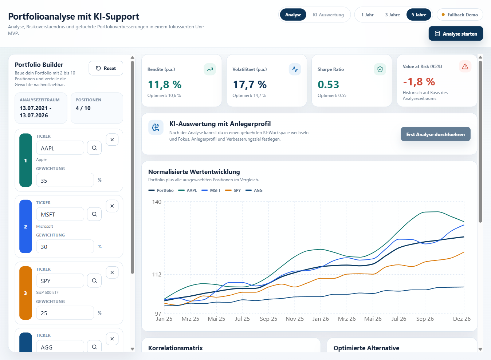

# Portfolio Analysis with AI Support

**Application documentation — current version as of 13 July 2026**

## Purpose

This web application is a university MVP for exploring the historical risk and return profile of a portfolio of shares and ETFs. It combines portfolio input, historical analysis, a calculated comparison allocation, and a guided AI-supported interpretation.

It is an analysis and learning tool. Historical values are not forecasts, and the application does **not** provide investment advice or place trades.

## At a glance

*Figure 1 — Dashboard captured on 13 July 2026, before a new analysis is started. The initial values shown are the stable demo view.*

The interface has two main areas:

| Area | What it is for |
| --- | --- |
| **Portfolio Builder** (left) | Enter between two and ten shares or ETFs and assign each a portfolio weight. |
| **Analysis** (right) | Read key metrics, performance, correlations, risk findings, and an optimised comparison allocation. |
| **KI-Auswertung** (top tab) | After an analysis, work through a four-step guided interpretation tailored to a selected investor profile and objective. |

## First-use guide

1. In the header, choose **1 Jahr**, **3 Jahre**, or **5 Jahre**. The selected period determines the historical date range.
2. In **Portfolio Builder**, review or replace the default positions (AAPL, MSFT, SPY, and AGG). Set the desired percentage in each **Gewichtung** field.
3. Check **Gewichtungssumme** at the bottom of the builder. It must be **100%** before an analysis can start.
4. Click **Analyse starten** in the header or **Jetzt auswerten** in the sidebar.
5. Review the analysis results. To receive a tailored interpretation, click **Zur KI-Auswertung wechseln** or the **KI-Auswertung** tab.

Changing a ticker, weight, or analysis period clears the completed analysis and any generated AI result. Run the analysis again after making changes.

## Building a portfolio

### Entering positions

- Type a ticker symbol directly in a **Ticker** field, for example `AAPL`, `MSFT`, or `SPY`.
- Or click the magnifying-glass icon next to a ticker field. In the **Position suchen** window, enter at least two characters of a company name or ticker, then click a result to apply it to that row.
- The search combines a small local quick catalogue with Yahoo Finance results when available. Each result shows its ticker, name, type (share/ETF), and exchange.
- Click **Position hinzufügen** to add a row. The app supports a maximum of 10 positions.
- Click the **×** at the end of a row to remove it. At least 2 positions must remain.
- Click **Reset** to restore the default four-position portfolio and the five-year period.

### Weight rules

Each weight is an integer percentage from 0 to 100. The total must be 100% (a tolerance of 0.5 percentage points is accepted by the interface). Duplicate ticker symbols and blank ticker fields are rejected when the analysis is started.

## Understanding the analysis workspace

Before an analysis is run, the dashboard displays a visual demo so that the layout remains understandable. Once **Analyse starten** is clicked, the backend loads price history and calculates the portfolio values.

The status pill in the header tells you which data state you are seeing:

| Status | Meaning |
| --- | --- |
| **Live-Daten** | Historical market data was successfully retrieved through Yahoo Finance (via `yfinance`). |
| **Fallback-Demo** | The demo data is displayed, either before the first analysis or because live data was unavailable. It is suitable for demonstrating the UI, not for a live-market conclusion. |

### Key metrics

The four cards at the top show the current portfolio and a smaller comparison value for the optimised alternative:

| Metric | What to expect |
| --- | --- |
| **Rendite (p.a.)** | Annualised historical return for the selected period. |
| **Volatilität (p.a.)** | Annualised historical fluctuation; higher values indicate larger historic swings. |
| **Sharpe Ratio** | Risk-adjusted return measure using the configured risk-free rate. Higher is generally more efficient, subject to the limitations of historical data. |
| **Value at Risk (95%)** | Historical loss threshold shown at a 95% confidence level for the selected analysis. It is an estimate, not a maximum possible loss. |

### Charts and findings

- **Normalisierte Wertentwicklung** compares the portfolio with its four largest positions. If there are more than four positions, the remaining tickers are labelled as not shown in the chart.
- **Korrelationsmatrix** shows how positions moved relative to one another historically. Values nearer **+1** represent similar movement; values nearer **−1** represent opposite movement. It helps identify whether a portfolio is truly diversified.
- **Optimierte Alternative** is a calculated max-Sharpe comparison allocation. It lists current weight, percentage-point change, and suggested weight for each position. It is a comparison model, not an automatic change to the portfolio.
- **Auffälligkeiten** lists up to four rule-based observations, such as concentration, correlation, diversification, volatility, or risk/return concerns. These observations also inform the later AI interpretation.

## Guided AI evaluation

The **KI-Auswertung** tab stays disabled until a portfolio analysis exists. The guided flow requires four steps:

1. **Analysis focus** — select one or more areas: overall view, sector allocation, concentration risk, diversification/correlation, and risk drivers.
2. **Investor profile** — choose both a time horizon (short, medium, or long term) and a risk style (defensive, balanced, or aggressive).
3. **Improvement goal** — choose broad diversification, retain a technology focus, a more defensive setup, or a balanced return-risk target. An optional free-text note can add context.
4. **Generate report** — click **KI-Auswertung erstellen**.

The generated report can include:

- a short conclusion and profile fit;
- analysis highlights and sector observations;
- concrete next steps;
- suggested weight adjustments relative to the calculated comparison allocation;
- new share/ETF ideas and existing holdings to review;
- available news hints, which open their source in a new browser tab.

The report footer identifies whether the interpretation came from a local Ollama model or the built-in **Regel-Fallback**. If Ollama is not running or cannot return a valid answer, the application automatically uses the rule-based fallback so the workflow remains usable.

## What is intentionally not available in the current interface

- There is no login, account connection, order placement, or trade execution.
- Portfolio changes are not saved through a visible save/load control; refreshing the page resets the current browser session.
- The backend provides CSV and PDF export endpoints, but this version of the web interface does not show export buttons.
- News hints and market data depend on external availability and may be missing, delayed, or unavailable for individual tickers.

## Common messages and how to proceed

| Message or state | What to do |
| --- | --- |
| **Gewichtungssumme** is not 100% | Adjust the percentages until the total is 100%, then start the analysis again. |
| Duplicate or empty tickers | Give every row a non-empty, unique ticker. |
| Search returns no result | Try a more specific ticker/name. Search needs at least two characters and depends partly on the connected data source. |
| Backend not reachable / request timed out | Start or restart the local FastAPI backend, then retry. The frontend expects it on port 8000 when running locally. |
| **Fallback-Demo** remains visible | The UI can still be explored, but live historical data could not be loaded. Check the backend and network connection before relying on results. |

## Local operation

For local development, follow the setup in [README.md](../README.md). When frontend and backend are running, open [http://127.0.0.1:5173](http://127.0.0.1:5173). The application uses the FastAPI backend at `http://127.0.0.1:8000` for security search, analysis, and AI recommendations.

## Data and usage notice

The calculations use historical data and may fall back to deterministic demo data when required services are not available. Results, recommendations, suggested allocations, and news hints are informational only. Always perform independent research and seek qualified advice before making investment decisions.
